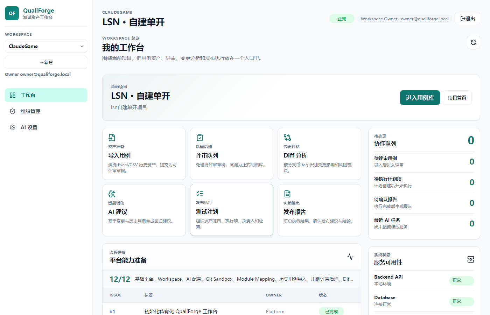
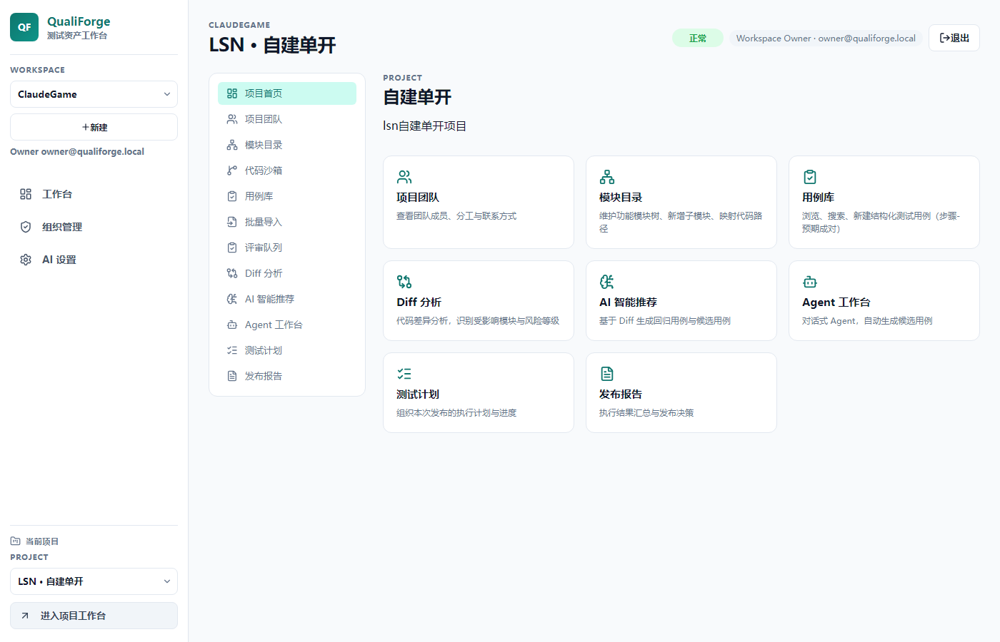
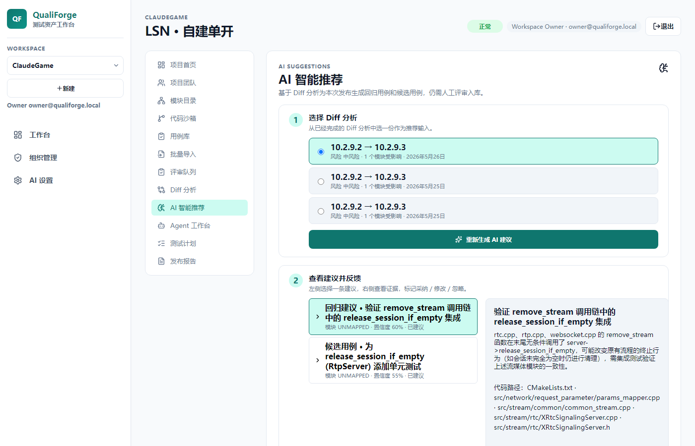
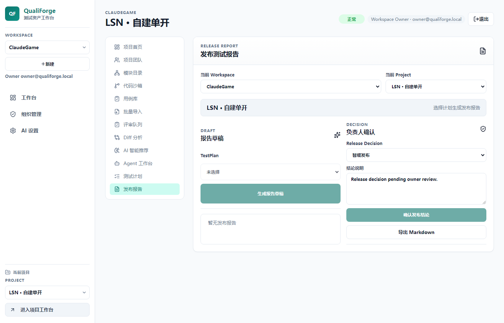

# QualiForge

**AI 原生测试资产工作台** — 为中小型工程与 QA 团队打造的私有化部署平台。

将零散的历史测试用例、GitLab 仓库上下文、版本 Tag diff、评审流程、测试计划执行和发布报告，整合为一个人与 AI 都能高效使用的结构化知识库。

---

## 界面预览

<table>
<tr>
<td width="50%" valign="top">
<strong>工作台总览</strong><br><br>
<br>
工作区状态、项目列表与近期活动一览。
</td>
<td width="50%" valign="top">
<strong>项目工作台</strong><br><br>
<br>
用例库、Diff 分析、AI 建议、测试计划与发布报告集中管理。
</td>
</tr>
<tr>
<td width="50%" valign="top">
<strong>AI 建议</strong><br><br>
<br>
基于 tag diff 生成测试用例候选，人工确认后方可入库。
</td>
<td width="50%" valign="top">
<strong>发布报告</strong><br><br>
<br>
AI 起草摘要与风险评估，人工确认发布决策，支持 Markdown 导出。
</td>
</tr>
</table>

---

## 核心能力

| 能力 | 说明 |
|------|------|
| **用例库治理** | 草稿 → 待审 → 批准 → 归档完整状态流，版本快照，评审意见 |
| **GitLab 集成** | 只读仓库镜像，Tag diff 分析，模块映射规则自动关联 |
| **AI 辅助** | 用例归一化、Diff 建议生成、报告起草；AI 只能建议，不能绕过人工审批 |
| **测试计划** | 发布 / 回归 / 冒烟 / 特性 / 自定义，正式用例快照 + AI 临时条目 + 手工条目 |
| **发布报告** | AI 起草 + 人工确认发布决策，完整审计链，Markdown 导出 |
| **私有化部署** | Docker Compose 一键启动，所有数据本地存储 |

---

## 快速启动

```powershell
Copy-Item .env.example .env
docker compose up --build
```

启动后访问：

- **工作台**：http://localhost:5173
- **后端健康检查**：http://localhost:8000/api/health

---

## AI 模型配置

默认对接 DeepSeek OpenAI 兼容接口，在 `.env` 中配置：

```env
QUALIFORGE_MODEL_GATEWAY_PROVIDER=deepseek
QUALIFORGE_MODEL_GATEWAY_API_BASE_URL=https://api.deepseek.com
QUALIFORGE_MODEL_GATEWAY_API_KEY=your-api-key
QUALIFORGE_MODEL_GATEWAY_DEFAULT_MODEL=deepseek-v4-pro
QUALIFORGE_MODEL_GATEWAY_REASONING_EFFORT=high
```

支持任意 OpenAI 兼容端点：直接 Provider API、本地模型服务、NewAPI 或其他网关。

---

## 本地开发

**后端：**

```powershell
Set-Location backend
uv sync
uv run pytest tests
uv run uvicorn app.main:app --reload
```

**前端：**

```powershell
Set-Location frontend
npm install
npm run dev
```

**Temporal 工作流冒烟测试（需 Docker Compose 已启动）：**

```powershell
docker compose up -d postgres redis temporal backend worker
python scripts/smoke_temporal_compose.py
```

---

## 技术栈

- **后端**：FastAPI · PostgreSQL · Redis · Temporal（Durable Workflow）
- **前端**：React · Vite · TypeScript
- **AI**：OpenAI 兼容接口，结构化候选生成，非流式 completion
- **部署**：Docker Compose，`postgres:18-alpine`

---

## 产品原则

- AI 可以建议、归一化、摘要、起草，但**不能绕过人工审核**进入正式用例库。
- Git 仓库分析全程**只读**，平台不运行项目代码、不启动服务、不执行任意命令。
- 黑盒测试人员无需了解代码路径，技术关联由系统推断，人工可确认或纠正。
